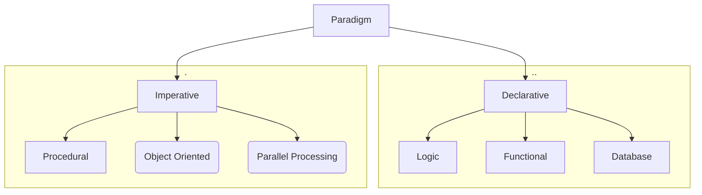

---

[TOC]

---

# Introduction

Programming languages are the tools that computer engineers use to solve computational problems. There are a myriad of computer languages, but they have in common one single objective:

- Translate a set of words/instructions, provided by a programmer to solve a problem, into machine instructions.

It is important to know, that at the end, a processor is a machine that requires specific instructions, and can only execute the instructions that were build into its architecture.

When coding (writing down lines of text describing an algorithm that solves a given problem), words or instructions can take any form:

- common vocabulary: *if temperature is greater or equal than 20°C ,then turn LED on, else turn LED off.*
- mnemonics/symbols: `LED = (t >= 20) ? (1) : (0);`
- mathematical symbols: f(t) = $f_{LED}(t) =  \lfloor \frac{t}{100} + (0.5 - \frac{20}{100})\rfloor$
- a hexadecimal number representing a machine instruction `0x00a70733` (RISC-V `add  a4,a4,a0`)

Machine instructions are chains of bits `{1|0}` that provide the processor the input values to its logic gates, and in so, performing logic/arithmetic operations.

# Programming Paradigms

> Usual definition: a programming paradigm is a way or style of programming.

A problem can be solved in different ways. The way to solve it or the how to come/write the solution depends on the programming paradigm used.

In computer science, programming paradigms are split in two categories:

- Imperative: refers to explicitly writing instructions to solve a problem. It is a direct approach to tell the system what to do, following more or less the processor/system architecture. The programmer needs to describe the control flow.
- Declarative: refers to describe what needs to be done to solve a problem. The programmer needs to describe what operations are required on the data to obtain a result. The how to implement the what is left to the language implementation.

It is important to know, that the paradigm used to solve a problem depends on the type of the problem. Although, it would be possible to solve any problem with any programming paradigm, finding the optimal implementation/language/paradigm is a task for the programmer.

https://www.youtube.com/watch?v=E7Fbf7R3x6I

## Imperative

Programming style: programmer provides coding instructions

### Procedural

A bunch of functions with instructions that can be reused. Programmer defines functions and pass data between them.

### Object Oriented

Everything is an object. An object has properties (variables) and methods (functions). Programmer define an object, its properties and a set of methods that change the state of the object. Programmer describes how the object interact between them.

#### OOP Design Patterns

### Parallel Processing

Break up tasks among multiple processors

##  Declarative

Programming style: programmer describes in a more natural form what result is needed.

### Logic

### Functional

Taking procedural to a higher level, making functions:

- Immutable
- A variable (first class citizen) (e.g. can be assigned to variables, passed as arguments and returned from other functions)
- No internal state (pure function)

## Programming Languages Objectives

### Abstraction

- Help transform ideas/solutions
- Safe
- With less lines  of code

# References

[The Declarative Delusion](https://jenkov.com/tutorials/opinion/the-declarative-delusion.html)

[Declarative Programming in Depth](https://blog.ndepend.com/declarative-programming-depth/)

[Types of programming](https://www.reddit.com/r/learnprogramming/comments/utih5/comment/c4yfztm/?utm_source=share&utm_medium=web2x&context=3)
