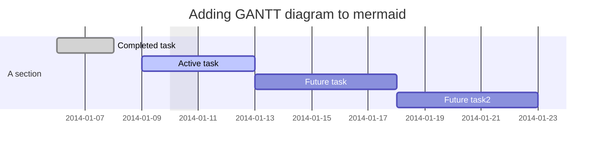

# GitHub Markdown test

---

## Headings

### H3

#### H4

##### H5

###### H6 (The smallest heading)

---

## Table(s)

| Command | Description | Aligment left |
| :---         |     :---:      |          ---: |
| `git status` | List all *new or modified* files | left |
| `git diff` | Show file differences that **haven't been** staged | left |

---

## Collapsable

<details> <summary>CLICK ME</summary>

<div markdown="1">

#### We can hide anything, even code!

```cpp
int main(int argc, char* argv[]) {
    return 0;
}
```

</div>
</details>

---

## Image(s)

{:height="128px" width="64px"}

{:height="128px"}

---

## Lists

1. A
2. B
3. C

- A
- B
- C

1. a
   1. b
   2. c

---

## Emoji

:+1: with text :rocket:

---

## Footnotes

Here is a simple footnote[^1].

A footnote can also have multiple lines[^2].  

You can also use words, to fit your writing style more closely[^note].

[^1]: My reference.
[^2]: Every new line should be prefixed with 2 spaces.  
  This allows you to have a footnote with multiple lines.
[^note]:
    Named footnotes will still render with numbers instead of the text but allow easier identification and linking.  
    This footnote also has been made with a different syntax using 4 spaces for new lines.

---

## Spaechip plugin

| :                   MathJax \|\| Image                 : |||
| :------------ | :-------- | :----------------------------- |
| Apple         | : Apple : | Apple                          \
| Banana        | Banana    | Banana                         \
| Orange        | Orange    | Orange                         |
| :     Rowspan is 4     : || :        How's it?           : |
| ^^     A. Peach          ||    1. ![example][cell-image]{: height="36px" width="36px"}   |
| ^^     B. Orange         || ^^ 2. $I = \int \rho R^{2} dV$ |
| ^^     C. Banana         || **It's OK!**                   |

[cell-image]: https://jekyllrb.com/img/octojekyll.png

### Math

This sentence uses `$` delimiters to show math inline:  $\sqrt{3x-1}+(1+x)^2$

**The Cauchy-Schwarz Inequality**

$$
\left( \sum_{k=1}^n a_k b_k \right)^2 \leq \left( \sum_{k=1}^n a_k^2 \right) \left( \sum_{k=1}^n b_k^2 \right)
$$

### Mermaid




### Video


---
